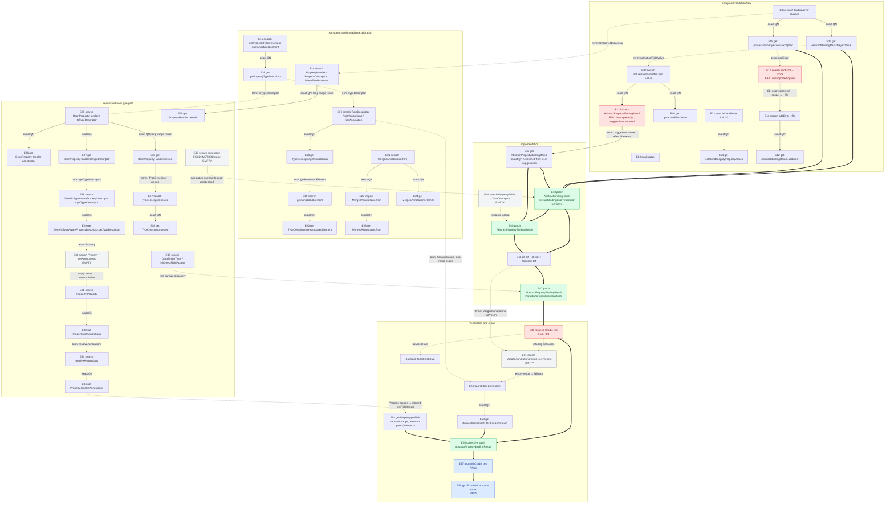

# Lane 1 R6 call dependency tree

Source:

- Run: `lane1-r6-direct-gcal-c-fc6d181-20260727/L0`
- Trace: `smoke/2026-07-27T15-55-19-569Z/goldeneye-code-agent-layer/smoke-spring-sensitive-value-redaction-level0-goldeneye-code-agent-layer/codex.jsonl`
- Result: `PASS`; 50 command executions, 4 patch operations, 5 agent messages

This is a dependency DAG, not only a chronological sequence. It shows whether a call consumed data or state produced by an earlier call.

## Legend

- Solid arrow, `A --> B`: exact response reuse. `B`'s requested qualified name occurs verbatim in `A`'s response.
- Dashed arrow, `A -.-> B`: inferred semantic reuse, query refinement, negative-result fallback, or failure-driven diagnosis.
- Thick arrow, `A ==> B`: mutation/verification control dependency.
- Red node: failed call.
- Gray node: empty/near-empty response.
- Nodes without incoming arrows: independent discovery roots; no prior-response dependency detected.

## Full dependency DAG

## Response-reuse ledger

| Consumer class | Calls | Prior-response use |
|---|---:|---|
| `gcal get` / `gcal inspect` | 23 | 22 exact QN matches; E54 semantic |
| `gcal search` | 21 | 15 derived/refined/retry searches; 6 independent roots |
| Patch operations | 4 | All depend on retrieved source, diff, or test failure |
| Verification/diagnostics | 5 | Patches → tests; failed test → XML/search repair; passing test → final diff |

Independent search roots:

- E03: `DataBinder`
- E05: binding/error classes
- E15: `getPropertyTypeDescriptor|getAnnotatedElement`
- E21: `MergedAnnotations.from`
- E39: `DataBinderTests|initDirectFieldAccess`
- E40: annotation `FIELD` + `METHOD` target

High-value reuse:

- E13 failed, but its suggestions were retained and used exactly by E42 after 28 intervening events.
- E14 fed E35 after 21 events.
- E17 fed E52 after 35 events.
- E25 fed E36 after 11 events.

Correction chains:

- E10 invalid `--scope` → E11 corrected `--file` → E12 exact `get`.
- E30 empty → E31 reformulated search → E32 exact `get`.
- T1 failed 3/4 → E50/E51 diagnosis → E52/E53/E54 repair evidence → P4 → T2 pass.

## Main finding

Prior responses were heavily reused: 22/23 source retrievals have exact machine-verifiable ancestry. Main inefficiency is excessive fan-out, not discarded context: six root searches expanded into 21 searches and 23 retrieval/inspection calls before convergence.
